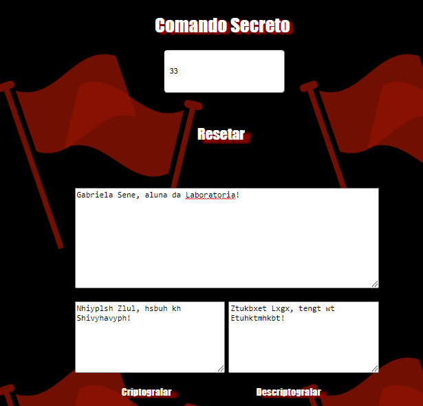

# Levante Popular

## Introdução

A organização militante Levante Popular nasceu em meados de 2020, prezando a atuação de fiscalizar irresponsabilidades governamentais. A organização reuniu uma parte da população que tinha o desejo de participar ativamente dos processos visando uma nação mais justa e responsável, se reunindo com reuniões e frequências para consolidar a ideia e cumprir com responsabilidade social para que qualquer ato de corrupção viesse a público e fosse impedido de fluir em sociedade. Com a organização ganhando visibilidade nas redes sociais e consequentemente, apoio da população em sua missão, os organizadores passaram a sofrer perseguições, ameaças, invasões hackers à seus celulares/computadores de inúmeros grupos respaldados pela corrupção e que temiam a prisão, ocasionando uma enorme necessidade de segurança, tanto com suas identidades, quanto a proteção de dados e informações trocadas entre membros da organização, a fim de evitar queima de arquivo de provas conquistadas e também evitar o vazamento das suas respectivas missões. Pensando nisso, o time técnico da Levante Popular, criou uma ferramenta de criptografia por meio da Cifra de César para se comunicarem entre eles, possibilitando maior segurança para reuniões presenciais, atos de manifestações, possíveis alertas de risco, alertas emergênciais de movimentações internas envolvendo atos ilícitos, entre outras necessidades que podem ser aplicadas ao uso de mensagens cifradas.

## Afinal, o que é a Cifra de César?

A Cifra de César é uma das mais simples técnicas de criptografia de que se tem notícia. O processo consiste em trocar as posições das letras do alfabeto, por exemplo: o A se transformaria em D, B em E e assim por diante. Essa técnica recebeu esse nome em homenagem a Júlio César, que usava mensagens cifradas para comunicar-se com seus generais nos tempos de batalha. (Fonte: Wikipedia - https://pt.wikipedia.org/wiki/Cifra_de_C%C3%A9sar)

## Objetivo do projeto

A lógica Cipher of Caesar desenvolvida em JavaScript é a primeira proposta de projeto da Laboratória para as alunas no bootcamp de 2022.

## Algumas considerações

A intenção desse projeto acompanha uma interface simples e didática, pensando na experiência do usuário ao se deparar sozinho com essa web aplicação, por esse motivo segue uma estrutura que aponta para a sua respectiva função: no campo "Escolha seu deslocamento", o usuário vai escolher um número que indique como sua mensagem vai se deslocar para criar a criptografia. O botão "Reset" vem para auxiliar na limpeza de todos os formulários da página quando necessário, evitando que o usuário precise utilizar a barra "Backspace" para apagar letra por letra. O campo de texto "Deixe seu alerta aqui", indicando onde o usuário deve escrever a mensagem que deseja repassar. E por fim, os campos alinhados com seus respectivos botões de Criptografar e Descriptografar, aulixando o usuário a visualizar onde cada mensagem vai aparecer, baseado na escolha do botão. Essa página foi elaborada em HTML, CSS e JavaScript puro (Vanilla JS), utilizando DOM para criar um sistema de codificação e decodificação de mensagens, considerando letras maiúsculas, minúsculas, números e caracteres especiais. 

## O que foi feito

- [x] Elaboração de um arquivo `README.md` com imagem e explicações sobre o projeto.
- [x] Uso de VanillaJS.
- [x] Exibição do resultado correto da cifra.
- [x] Permitir a inclusão de um texto com letras maiúsculas para ser decifrado.
- [X] Mostrar o resultado decifrado corretamente.
- [X] Permitir a escolha do `offset` (deslocamento) a ser usado na cifragem/decifragem de textos.
- [x] Permitir a inclusão de um texto com letras minúsculas, caracteres especiais e espaço para
      cifrar e decifrar.
- [X] Inclusão de um botão "Reset" para limpar os formulários.

 ## Autora

 Gabriela Sene, aluna do bootcamp da Laboratória - Turma SAP008 do ano de 2022. 
